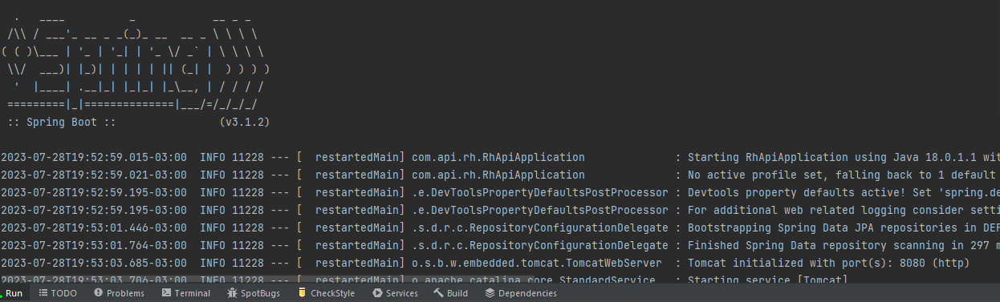
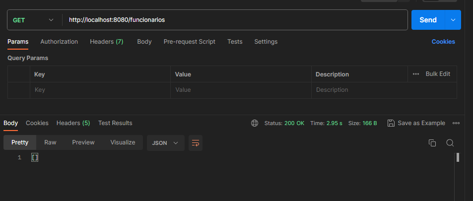
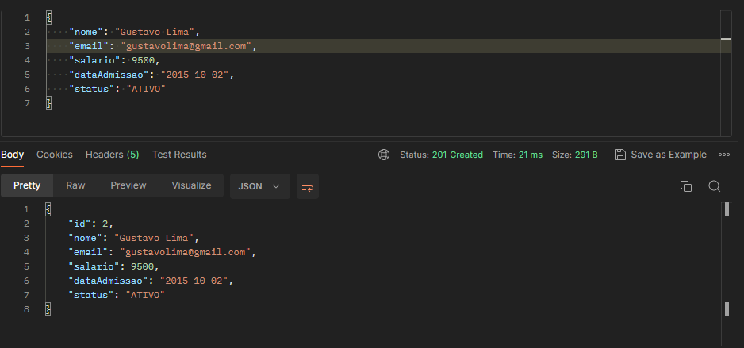
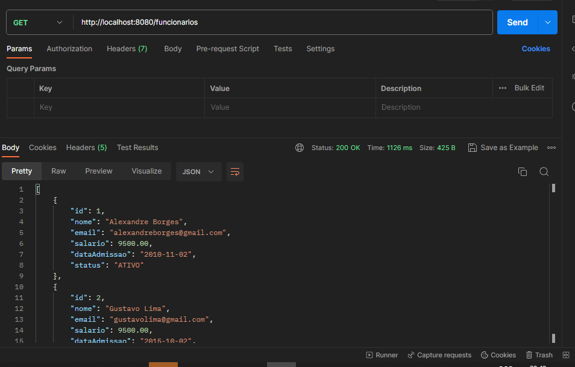

# API Java e Spring Boot.

> Projeto api desenvolvido com Java e Spring Boot.

Esse repositório armazena um projeto de API Java e Spring boot que representa 
um RH onde se pode cadastrar, listar e alterar um cadastro de um funcionário.

Aplicação iniciada:

Aplicação sem nenhum cadastro:

> Rota POST para cadastrar funcionários.
>
>> http://localhost:8080/funcionarios.

> #### Parâmetros usados para realizar um cadastro de funcionário:
>
> - nome:
> - email:
> - salario:
> - dataAdmissao:
> - status:

Exemplos de cadastros:

> Rota GET para listar funcionários cadastrados.
>
>> http://localhost:8080/funcionarios.

Exemplos de funcionários listados:

## Tecnologias
- Java
- Spring boot
- Git e GitHub